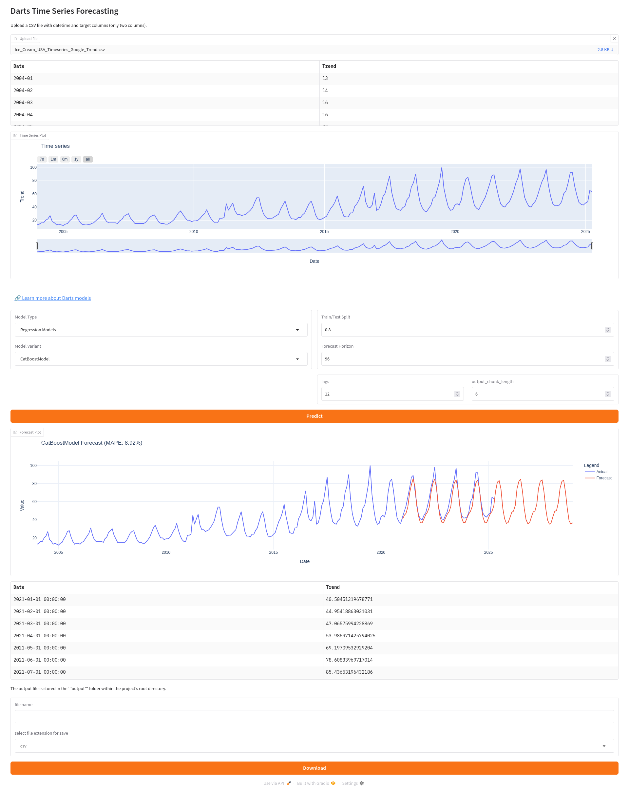

# ⏳ TimeLock: 

**TimeLock** is a user-friendly tool for time series forecasting built on top of the [Darts](https://github.com/unit8co/darts) library. 

---

## ✅ Features

- ⚡ Easy-to-use CLI and Python interface  
- 🧠 Access to cutting-edge models (ARIMA, Prophet, RNNs, N-BEATS, TFT, etc.)  
- 📈 Visualization of forecasts and historical data  
---

## 📋 Prerequisites

- Linux-based operating system (recommended)  
- Python 3.8 or higher  
- Git  
- Installation on Windows may be possible, but it has not been tested
---

## 🚀 Installation

1. **Clone the repository:**

   ```bash
   git clone https://github.com/TemporalDepth/TimeLock
   cd TimeLock
   ```

2. **Create and activate a virtual environment:**

   ```bash
   python3 -m venv venv
   source venv/bin/activate
   ```

3. **Install dependencies (for CPU-only by default):**

   ```bash
   pip install -r requirements-cpu.txt
   ```

   > 🧠 The required libraries (including Darts and its dependencies) will be installed automatically.  
   > If you plan to use models based on PyTorch (e.g., RNNs, N-BEATS, TFT) **with GPU acceleration**, make sure:
   >
   > - You have an NVIDIA GPU with proper drivers  
   > - CUDA 12.6 is installed  
   > - You manually install the appropriate version of PyTorch with GPU support from [https://pytorch.org/get-started/locally/](https://pytorch.org/get-started/locally/)
   > - 💡 Alternatively, if you don't need GPU acceleration, you can simply install the latest CPU-only version of PyTorch — no need to install CUDA.
---

## 🧪 Quick Start

### Launch the application

If you're on Ubuntu or using a virtual environment, first activate it:
```bash
source venv/bin/activate
```

Then run the main script:
```bash
python main.py
```
or:
```bash
python3 main.py
```

---
## 🚧 Current Limitations

- Not all forecasting models provided by the [Darts](https://github.com/unit8co/darts) library are currently implemented in the project.
- Some model parameters are not yet supported.
- Advanced features and utilities offered by Darts—such as model ensembling, probabilistic forecasting, and automated hyperparameter tuning—are not yet integrated.

## 🛠️ Future Plans

- Compatible with Windows OS
- Support for **kwargs for flexible parameter configuration
- SQL query generation using SQLAlchemy
- Forecasting model comparison
- Automatic hyperparameter optimization with Optuna
- Support for alternative forecasting methods such as NeuralProphet

---

## 🖼️ interface example




## 📄 License

This project is licensed under the MIT License. See the [LICENSE](LICENSE) file for details.

---

## 🙌 Acknowledgments

- [Darts by Unit8](https://github.com/unit8co/darts) – the backbone of the forecasting engine.
